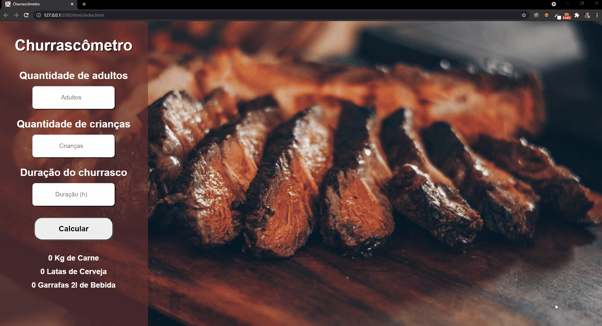
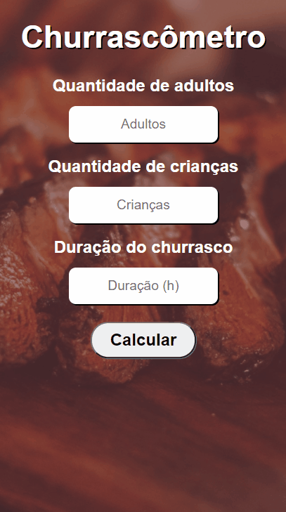

<h1 align="center">
Churrascômetro🍻
</h1>

 Project carried out with the objective of calculating the amount of meat, beer and other drinks in a barbecue based on the number of adults, children and duration of the event.

 In this project logical reasoning of programming and arithmetic operations was used. 

  

  
  

## Technologies:

- 💹**HTML**  
- 💹 **CSS** 
- 💹 **JAVASCRIPT**

## License

This project is licensed under the MIT License - see the [LICENSE](https://opensource.org/licenses/MIT) page for details.

